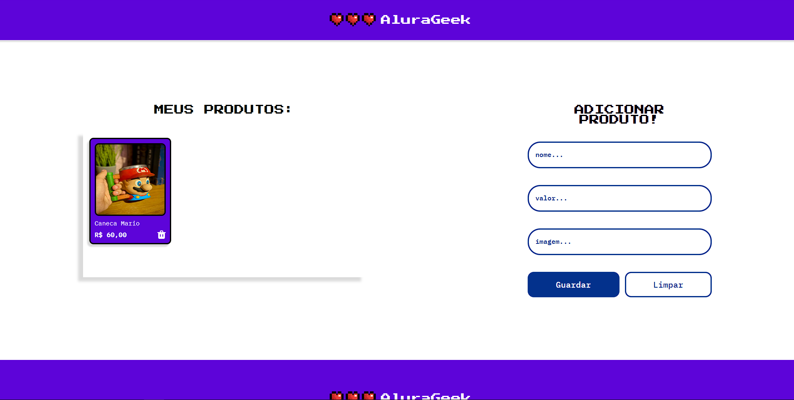

# Projeto Alura Geek

## Tecnologias Utilizadas
- HTML para estruturação da página
- CSS para estilização visual
- JavaScript para funcionalizando a página.
## Funcionalidades
- Cadastro de Produto: Inserindo o nome do produto, o valor e um link de imagem, você consegue criar um registro deste produto através do JavaScript e da função criarCardProduto, que será exibido no container "Meus produtos".
- Remover Produto: Pressionando o ícone de lixeira presente no card de cada produto, será possível que seu registro seja removido da API, através do JavaScript e da função removerProduto.
- Responsividade: Além disso, através de media queries no CSS, foi possível criar uma versão mobile.
  

    

## Informações Adicionais:
O projeto foi elaborado durante o curso de formação front-end da Alura, oferecido pela Oracle através do programa Oracle One.
Concluí o curso com sucesso e obtive o badge de conclusão: 

    

